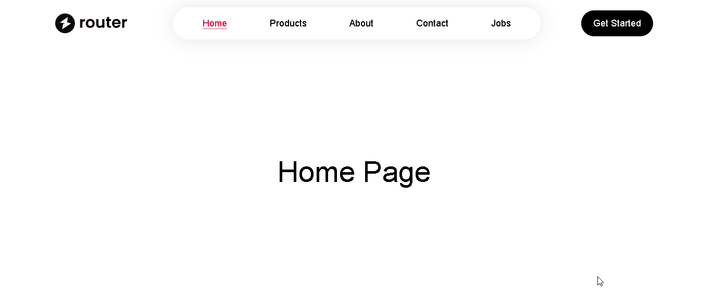

# React Router Practice Project

A practice project demonstrating the use of React Router DOM for client-side routing in a React application. This project showcases various routing concepts including nested routes, dynamic routes, and layout components.

## Demo



### Live Demo

[View Live Demo](https://react-router-practice-project-xi.vercel.app/)

## Features

- **Home Page**: Welcome page with navigation
- **About Page**: Information about the project
- **Jobs Page**: List of jobs with dynamic routing to job details
- **Products Page**: Product listing page
- **Contact Page**: Contact form and information
- **Error Handling**: Custom 404 page for invalid routes
- **Responsive Design**: Styled with Tailwind CSS
- **Nested Routes**: Organized routing structure with layouts

## Technologies Used

- **React 19**: Latest version of React
- **React Router DOM 7**: For client-side routing
- **Vite**: Fast build tool and development server
- **Tailwind CSS 4**: For styling
- **ESLint**: For code linting

## Installation

1. Clone the repository:
   ```bash
   git clone https://github.com/haiderali0509/react-router-practice-project.git
   cd react-router-practice-project
   ```

2. Install dependencies:

   ```bash
   npm install
   ```

3. Start the development server:

   ```bash
   npm run dev
   ```

4. Open your browser and navigate to `http://localhost:5173` (or the port shown in the terminal).

## Usage

- Navigate through the different pages using the navbar.
- Explore the jobs section to see dynamic routing in action.
- Fill out the contact form to test form handling.


## Scripts

- `npm run dev`: Start the development server
- `npm run build`: Build the project for production
- `npm run preview`: Preview the production build
- `npm run lint`: Run ESLint for code linting

## Contributing

1. Fork the repository
2. Create a feature branch (`git checkout -b feature/amazing-feature`)
3. Commit your changes (`git commit -m 'Add some amazing feature'`)
4. Push to the branch (`git push origin feature/amazing-feature`)
5. Open a Pull Request

## License

This project is licensed under the MIT License.
